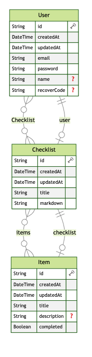

### Checklisty app

## Installation

1. Clone the repo
2. Install dependencies with `npm install` or `yarn install`
3. Install husky with `npm run husky:init` or `yarn husky:init`
4. Run PostgreSQL server in docker container with `docker-compose up -d`
5. Run initialization with `npm run db:reset`
6. Copy `.env.example` to `.env` and fill in the variables with your own values `cp .env.example .env`
7. Run the app with `npm run dev` or `yarn dev`
8. Open [http://localhost:3000](http://localhost:3000) with your browser to see the result.

## Entity Relationship Diagram

